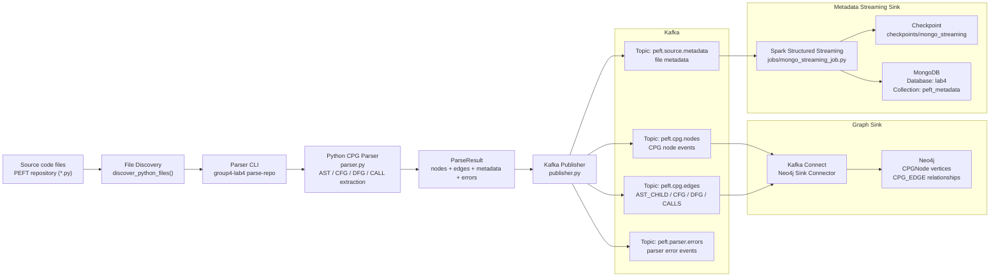

# Architecture Diagram

## System Architecture

## Data Flow

1. PEFT source code is scanned one Python file at a time.
2. The parser reads each file with Python `ast` and extracts CPG data: AST nodes, CFG edges, DFG edges, and call edges.
3. Events are published to Kafka by event type.
4. `peft.cpg.nodes` and `peft.cpg.edges` are consumed by Kafka Connect and written to Neo4j.
5. `peft.source.metadata` is consumed by Spark Structured Streaming and written to MongoDB.
6. `peft.parser.errors` stores parse failures for monitoring and debugging.
