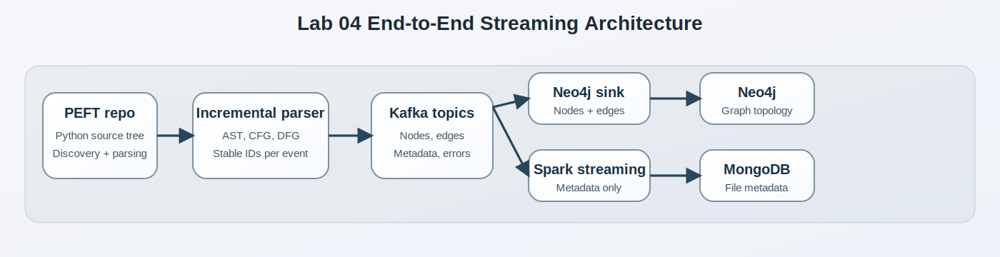

# Architecture

## End-to-end flow

## Component summary

- `src/group4_lab/discovery.py` finds Python files.
- `src/group4_lab/parser.py` builds nodes, edges, and metadata.
- `src/group4_lab/publisher.py` publishes to console or Kafka.
- `src/group4_lab/neo4j_tools.py` writes sink config and Cypher constraints.
- `src/group4_lab/mongo_streaming.py` writes the Spark job and MongoDB spec.
- `src/group4_lab/replay.py` compares before and after parses.

## Design choices

- The parser is file-oriented so it can run incrementally.
- IDs are deterministic so replay does not create duplicates.
- Metadata is separated from graph topology so each sink has a focused payload.
- The report is kept in Jupyter Book so the evidence can be published as a static site.

## Evidence slots

- Neo4j Browser screenshots: `assets/neo4j-node-count.jpg` and `assets/neo4j-relationship-count.jpg`
- MongoDB screenshot: `assets/mongo-compass-peft-metadata.jpg`
