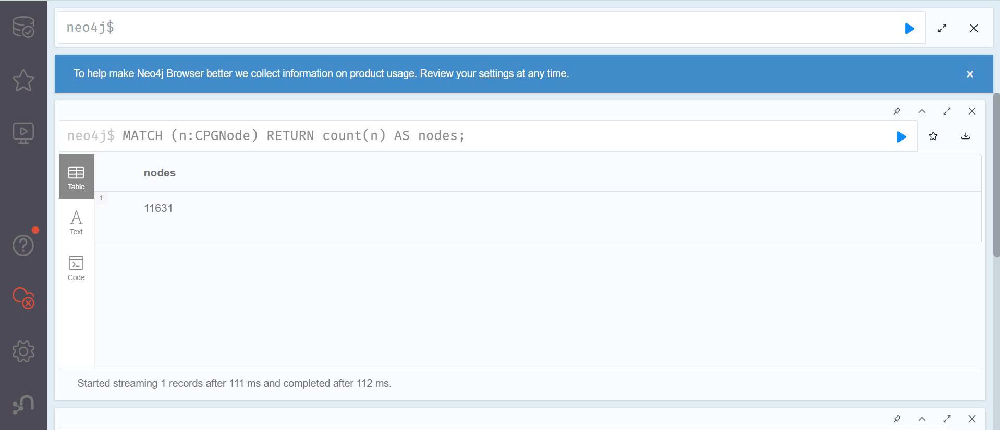
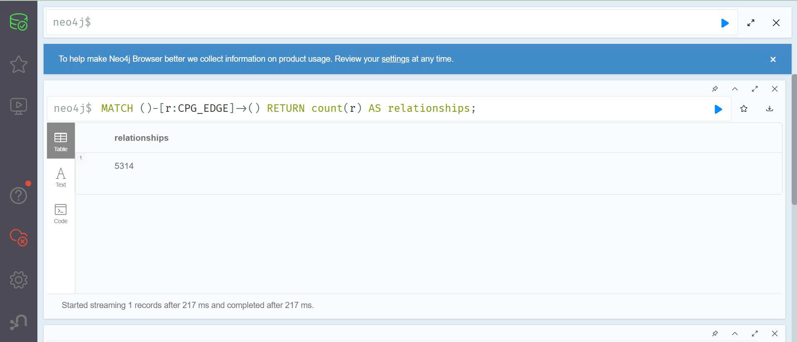

# Task 4

## Neo4j ingestion

Graph topology is written to Neo4j through the Kafka Connect sink configuration stored in `configs/neo4j/sink.properties`.

The sink is configured so that:

- node and edge topics are read separately
- stable IDs are used as merge keys
- repeated replay does not create duplicate graph objects

## Constraints

The repository also includes Cypher constraints in `configs/neo4j/constraints.cypher` so node and edge IDs remain unique.

## Visual evidence

The two screenshots below were captured from Neo4j Browser after ingesting the PEFT repository.

### Node count

### Relationship count

Together they show that the graph was populated with real data and that the Neo4j side is receiving the parsed CPG events correctly.

## Why `MERGE` matters

The replay requirement in the lab means the same file may be parsed more than once.
Using `MERGE` instead of `CREATE` ensures that if the event IDs stay the same, Neo4j updates the existing graph elements rather than duplicating them.

