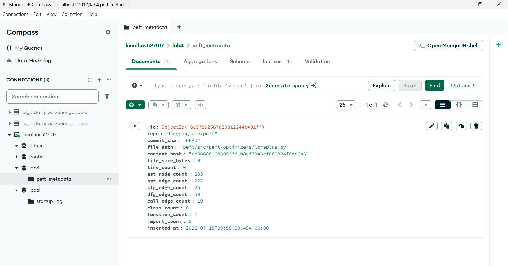
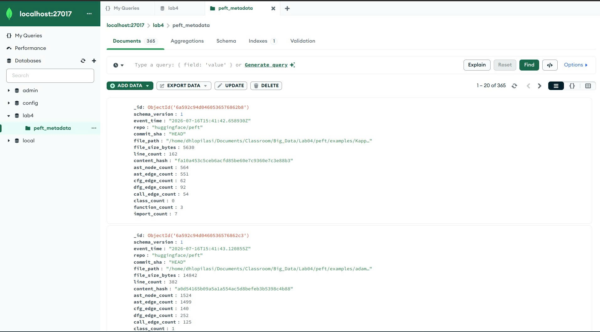

# Task 5

## MongoDB streaming

Only the file-level metadata topic is sent to MongoDB. This keeps the document store focused on summary data rather than full graph topology.

The streaming job is available in `jobs/mongo_streaming_job.py` and the same configuration is also generated by `group4_lab.mongo_streaming`.

## Stored metadata

Each MongoDB document can include:

- repository and commit information
- file path
- content hash
- file size and line count
- node and edge counts
- class, function, and import counts

## Checkpointing

The Spark job uses a checkpoint directory:

```text
checkpoints/mongo_streaming
```

That checkpoint is important because it allows the Structured Streaming job to resume from its previous offsets instead of starting from scratch.

## Visual evidence

Ảnh dưới đây là sample document xem bằng MongoDB Compass. Nhóm đặt ảnh này vào phần Task 5 để chứng minh rằng metadata từ Kafka/Spark đã được ghi thật vào MongoDB, đồng thời giúp người đọc nhìn thấy rõ schema và các field lưu cho từng file sau khi streaming.



Ảnh này là minh chứng cho Task 5, không chỉ là ảnh minh họa giao diện.

### Collection overview

This screenshot shows the `lab4.peft_metadata_full` collection with 365 documents in MongoDB Compass. It is direct evidence that Spark Structured Streaming wrote the full metadata set into MongoDB, not just a sample record.



It shows:

- at least one metadata document
- the file path and content hash
- node and edge count fields

## Report evidence to capture

- Spark job output
- one or two example metadata documents

